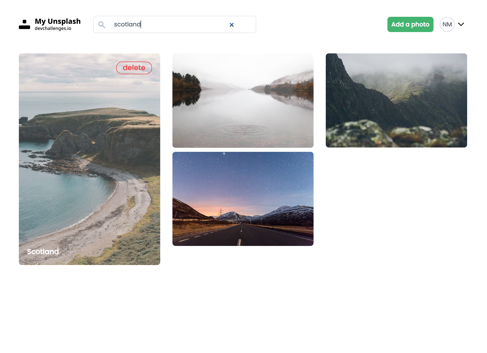

<!-- Please update value in the {}  -->

<h1 align="center">My Unsplash</h1>

<div align="center">
   Solution for a challenge from  <a href="http://devchallenges.io" target="_blank">Devchallenges.io</a>.
</div>

<div align="center">
  <h3>
    <span> | </span>
    <a href="https://github.com/tania0808/my-unsplash">
      Solution
    </a>
    <span> | </span>
    <a href="https://devchallenges.io/challenges/rYyhwJAxMfES5jNQ9YsP">
      Challenge
    </a>
  </h3>
</div>

<!-- TABLE OF CONTENTS -->

## Table of Contents

- [Overview](#overview)
  - [Built With](#built-with)
- [Features](#features)
- [How to use](#how-to-use)
- [Contact](#contact)
- [Acknowledgements](#acknowledgements)

<!-- OVERVIEW -->

## Overview

#### Built With




### Built With

- [React](https://reactjs.org/)
- [Redux Toolkit](https://redux-toolkit.js.org/)
- [Tailwind](https://tailwindcss.com/)

### Design ideas and useful links

- [Material Symbols Icons](https://fonts.google.com/icons)
- [Modal window in Tailwind](https://www.youtube.com/watch?v=kcpe4kqZaKg)
- [Autentication pages design](https://uidesigndaily.com/posts/sketch-login-log-in-authentication-mobile-day-565)
- [404 page design](https://uidesigndaily.com/posts/sketch-scrumbs-404-page-error-message-day-722)

## Features
Challenge: Create my Unsplash app. Use Front-end libraries like React or Vue. Create your own API. Don’t look at the existing solution. Fulfill user stories below:

- User story: I can create my acoount
- User story: I can login into my acoount
- User story: I can see a list of photos in the masonry layout that I have added
- User story: I can add a new photo to the list - the new photo should be on top of the list
- User story: I can search for photos by label
- User story: When I hover a photo, I can see a label and a delete button
- User story: I can delete images
- User story : When I delete an image, I can enter my password


## How To Use


To clone and run this application, you'll need [Git](https://git-scm.com) and [Node.js](https://nodejs.org/en/download/) (which comes with [npm](http://npmjs.com)) installed on your computer. From your command line:

```bash
# Clone this repository
$ git clone https://github.com/your-user-name/your-project-name

# Install dependencies both in back and front folders
$ npm install

# In both back and front folders, rename .env.sample to .env and insert your data to environmental variables

# Run the app in both front and back folders
$ npm start
```

## Acknowledgements

- [Masonry layout](https://dev.to/kdrbek/responsive-masonry-layout-with-tailwindcss-in-2-steps-4kkj)
- [Redux Toolkit](https://redux-toolkit.js.org/)

## Contact

- Website [My Portfolio](https://portfolio-tania-his.netlify.app/)
- GitHub [@tania0808](https://github.com/tania0808)
- Linkedin [Tetiana His](https://www.linkedin.com/in/tetiana-his/)
